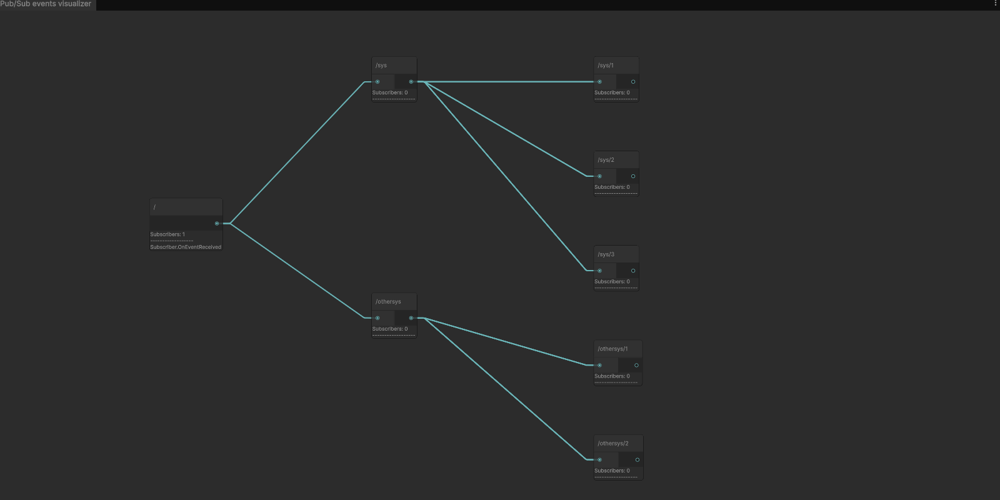

# Unity-PubSubEventSystem
A publish/subscribe game event system for Unity inspired by the MQTT protocol

## What is it?
This package provides the base classes to setup a publish/subscribe event system in your Unity project.
Events are organized in a tree structure, allowing you to subscribe to a specific event or all events in a specific branch.

## When to use it?
It may be useful every time you need to listen for a family of events and respond accordingly,
for example if you are making a built-in toast notification system that displays similar message on response to different events.

## Features
- Publish/Subscribe event system
- Event tree structure
- Runtime event visualization in the editor (with subscribers list and visual activation feedback)

## Samples
See the [Samples](Samples) folder for examples of how to use the package.

- Basic - Shows how to setup a basic publish/subscribe event system
- Custom Events - Shows how to create custom events and subscribe to them